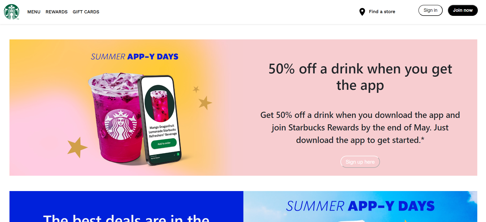
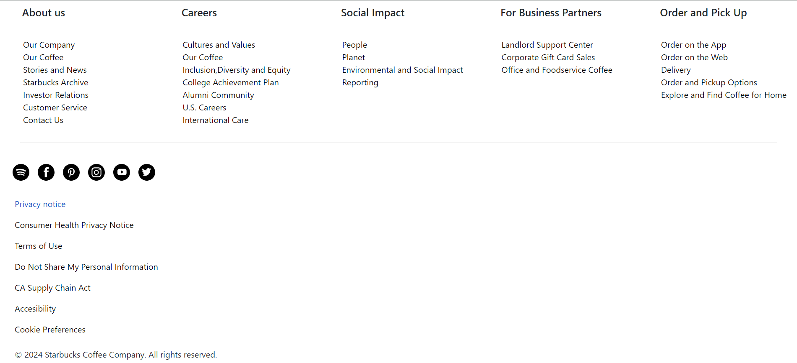
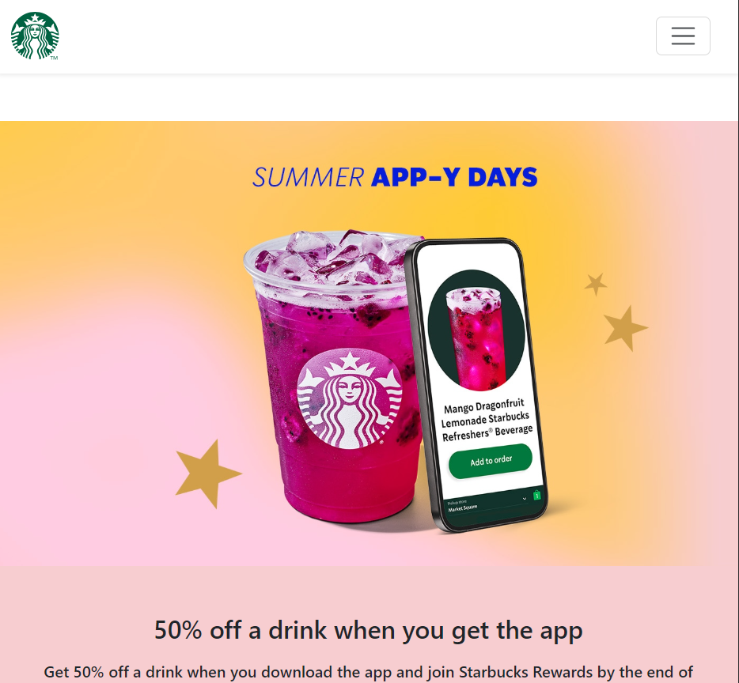
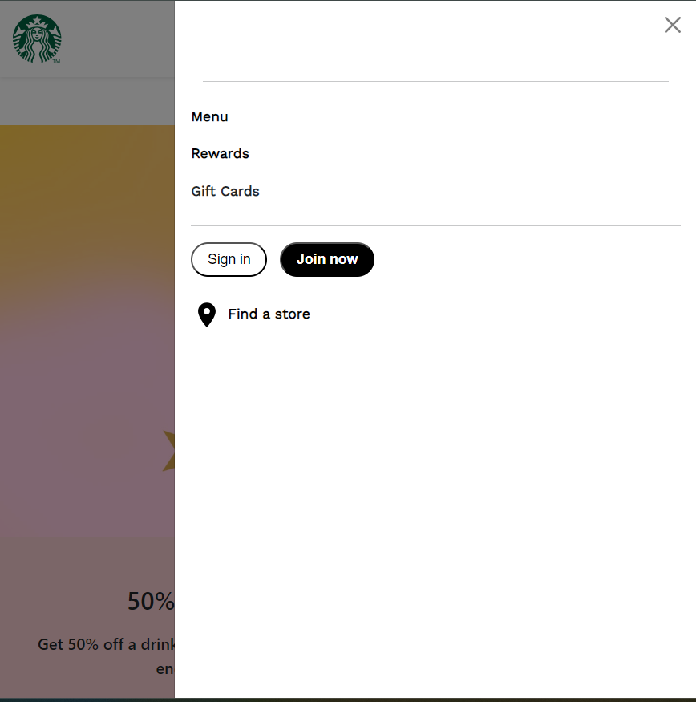
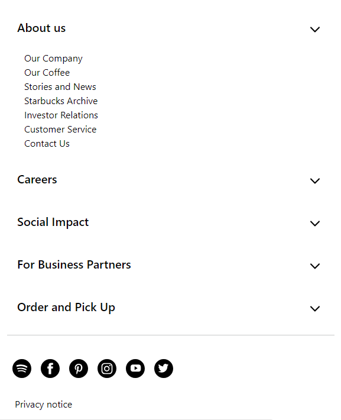

# Starbucks Website Clone

A responsive clone of the Starbucks website built using **HTML**, **CSS**, and **JavaScript**. This project focuses on the frontend implementation, featuring interactive components like **accordions**, **off-canvas menus**, **buttons**, and more.

## Features

- Mobile-first responsive design  
- Interactive UI elements using JavaScript  
- Accordions, off-canvas menus, and styled buttons  
- Clean and modern layout inspired by the official Starbucks site

## Screenshots

### Desktop View  
  
---


### Mobile View  
  
  


## Tech Stack

- HTML  
- CSS  
- JavaScript (Vanilla)

## Getting Started

1. Clone the repository  
   ```bash
   git clone https://github.com/yourusername/starbucks-clone.git
